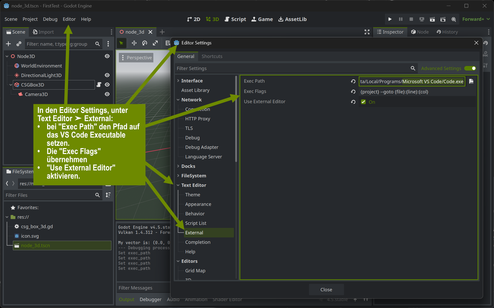
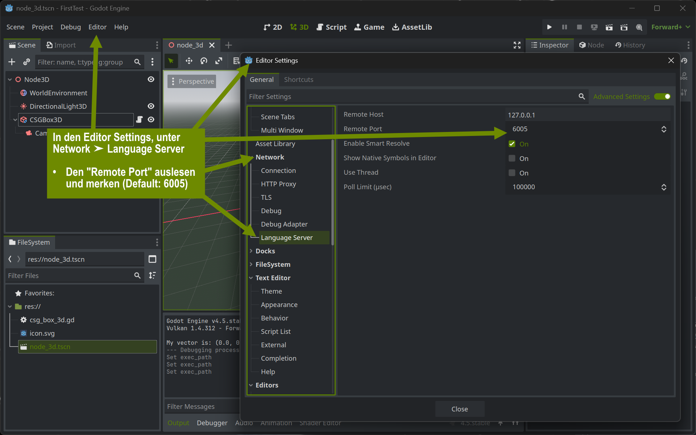
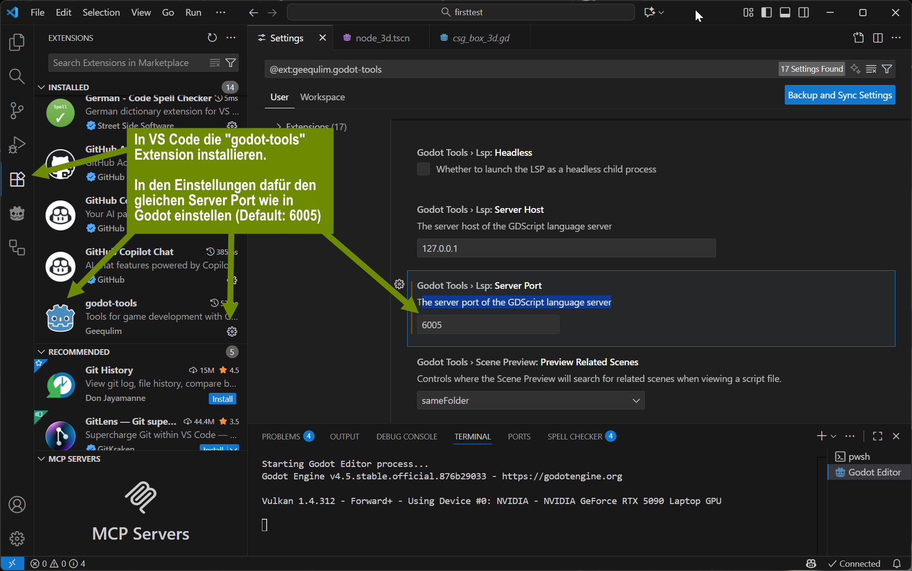

+++
title = 'Externe IDE'
draft = false
weight = 20 
+++

## Godot mit .NET oder ohne .NET

Godot kann entweder mit oder ohne .NET-Unterstützung (C#) verwendet werden. Die Wahl beeinflusst, welche Programmiersprachen und Features zur Verfügung stehen.

### Godot ohne .NET

- **Sprache:** GDScript (eigene Skriptsprache von Godot)
- **Vorteile:**
  - **Export als Web-Anwendung (HTML5) möglich.**
  - Geringerer Speicherbedarf und schnellere Startzeiten.
  - Keine zusätzlichen Abhängigkeiten (keine .NET-Laufzeit erforderlich).
  - Einfachere Verteilung und Installation.
  - Sehr gute Integration und Unterstützung aller Godot-Features.
- **Nachteile:**
  - GDScript ist weniger performant als C#.
  - Weniger externe Bibliotheken verfügbar.
  - GDScript ist weniger bekannt als C#.

### Godot mit .NET

- **Sprache:** C# (auch GDScript weiterhin nutzbar)
- **Vorteile:**
  - Nutzung von C# und dessen Ökosystem (z.B. NuGet-Pakete).
  - Bessere Performance bei komplexer Logik.
  - Bekannte Sprache für viele Entwickler (z.B. aus Unity).
  - Statische Typisierung und moderne Sprachfeatures.
- **Nachteile:**
  - **Größter Nachteil:** Spiele, die mit Godot .NET / C# erstellt wurden, können **nicht** als Web-Anwendung (HTML5) exportiert und somit nicht direkt im Browser ausgeführt werden.
  - Höherer Speicherbedarf und längere Startzeiten.
  - .NET-Laufzeit muss installiert sein.
  - Nicht alle Godot-Features sind immer sofort mit .NET verfügbar.
  - Komplexere Projektstruktur.

Für einfache Projekte, maximale Kompatibilität und Web-Publishing empfiehlt sich die Standardversion ohne .NET. Wer C# bevorzugt oder komplexere Logik umsetzen möchte, profitiert von der .NET-Version, muss aber mit mehr Ressourcenbedarf und der Einschränkung leben, dass kein Export für den Browser möglich ist.

## Visual Studio Code als externer Editor

Der Godot-Editor enthält bereits Code-Entwicklungswerkzeuge wie Text-Editor, Debugger und Profiler, die sich im  Funktionsumfang nicht hinter aktuellen Entwicklungsumgebungen wie Visual Studio Code verstecken muss. Für schnelle Prototypen und GDScript-Projekte ist der eingebaute Editor oft ausreichend und besonders für Einsteiger geeignet. Wer  komplexere Projekte umsetzt, C# verwendet oder von erweiterten Entwicklungsfunktionen profitieren möchte, ist mit Visual Studio Code meist besser beraten. Hier die Vor- und Nachteile:

### Eingebauter Editor (Godot)

**Vorteile:**
- Nahtlose Integration mit dem Godot-Editor (z.B. Drag-and-Drop von Nodes/Szenen in den Code).
- Keine zusätzliche Konfiguration notwendig.
- Plattformunabhängig und immer verfügbar.
- Automatische Synchronisation mit dem Projekt.
- Unterstützt GDScript und Shader-Programmierung direkt.

**Nachteile:**
- Weniger Features im Vergleich zu spezialisierten Code-Editoren (z.B. eingeschränkte Autovervollständigung, weniger Refactoring-Tools).
- Geringere Anpassbarkeit und weniger Erweiterungen/Plugins.
- Eingeschränkte Unterstützung für andere Sprachen wie C#.

### Visual Studio Code (externer Editor)
**Vorteile:**
- **Verwendung von KI-Coding-Tools (wie GitHub Copilot) zur Unterstützung beim Programmieren.**
- Leistungsfähige Code-Features wie Autovervollständigung, Linting, Refactoring und Debugging.
- Große Auswahl an Erweiterungen und Themes.
- Bessere Unterstützung für C# und andere Sprachen.
- Komfortable Navigation und leistungsstarke Suchfunktionen.
- Möglichkeit, mehrere Projekte und Dateitypen gleichzeitig zu bearbeiten.

**Nachteile:**
- Zusätzliche Einrichtung und Konfiguration notwendig (z.B. Godot- und C#-Plugins).
- Wechsel zwischen Godot und VS Code kann den Workflow unterbrechen.
- Drag-and-Drop-Integration aus dem Godot-Editor fehlt zum Teil. Mit der VS-Code-Extension "godot-tools" gibt es hier Unterstützung.
- Erfordert separate Installation und Updates.

## Einrichten von VS Code als externe IDE

Die folgende Beschreibung ist die Grundvoraussetzung, um in GDScript mit Visual Studio Code als externen Code-Editor in Godot zu verwenden. Um mit Godot .NET in C# mit VS Code zu entwickeln, sind ggf. weitere Schritte und zusätzliche VS Code Extensions nötig. 

1. **VS Code installieren:**  
  Lade Visual Studio Code von [https://code.visualstudio.com/](https://code.visualstudio.com/) herunter und installiere es.

2. **Godot öffnen und Projekt laden:**  
  Starte Godot und öffne dein gewünschtes Projekt.

3. **VS Code als externer Editor einstellen:**  
  - Öffne die **Projekteinstellungen** (`Projekt` → `Projekteinstellungen`).
  - Wechsle zum Tab **Editor** und dann zu **Text-Editor → Externer Editor**.
  - Aktiviere die Option **Externer Editor verwenden**.
  - Trage im Feld **Exec Path** den Pfad zur `Code.exe` ein (z.B. `C:/Users/{username}/AppData/Local/Programs/Microsoft VS Code/Code.exe` unter Windows).
  - Im Feld **Exec Flags** kannst du `--goto {file}:{line}:{col}` eintragen, damit VS Code die Datei direkt an der richtigen Stelle öffnet.
  

  - Unter Editor → Editor Settings → Network → Language Server → Remote Port den dort eingestellten Wert auslesen und merken (Default: 6005).
  

4. **Godot-Tools-Erweiterung installieren:**  
  - Installiere in VS Code die Extension **godot-tools** für bessere Integration (z.B. Autovervollständigung, Debugging).
  - In den Einstellungen für die godot-tools Extension, die Einstellung `Godot: Lsp Port` auf den in Godot voreingestellten Wert (Default 6005) einstellen.
  

5. **Testen:**  
  Öffne eine Skriptdatei im Godot-Editor – sie sollte nun automatisch in VS Code geöffnet werden.

## TODO: Weitere Schritte für die Entwicklung mit C# / .NET und VS Code

