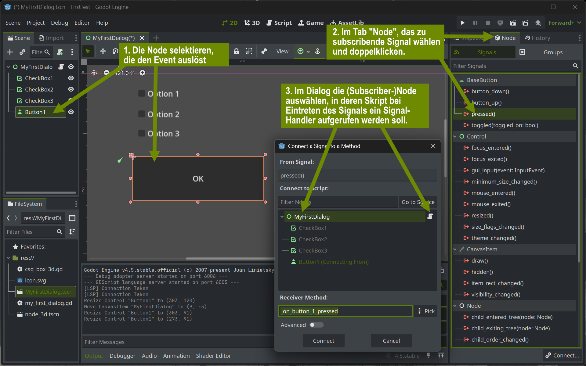
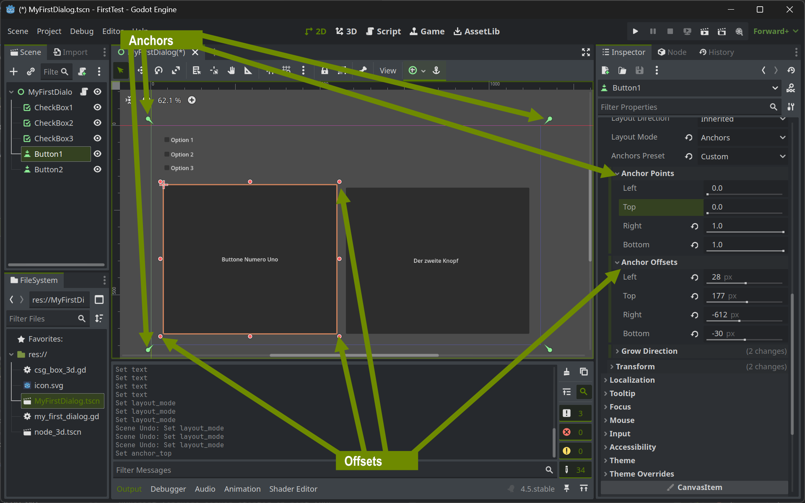
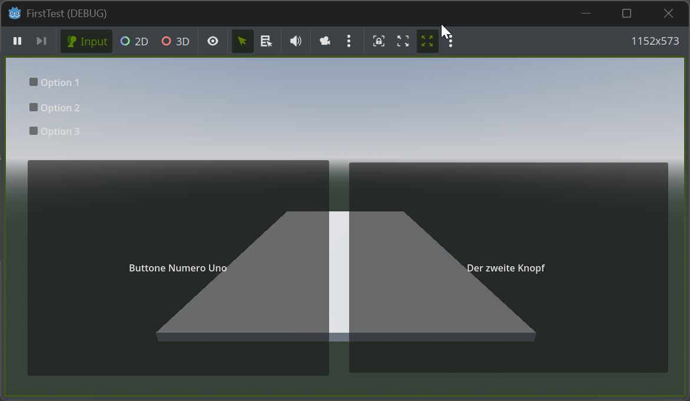
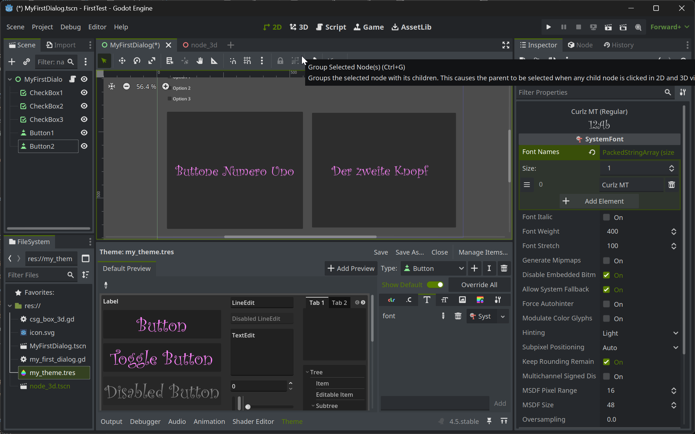

+++
title = 'Godot GUI'
draft = false
weight = 30 
+++

## Einführung in die UI-Entwicklung mit Godot

Godot bietet ein leistungsfähiges System zur Erstellung von Benutzeroberflächen (User Interfaces, UI). Mit Hilfe von sogenannten Control-Nodes können interaktive Elemente wie Buttons, Labels, Textfelder und vieles mehr gestaltet werden. Die UI-Elemente lassen sich flexibel anordnen und an verschiedene Bildschirmgrößen anpassen.

Die wichtigsten Vorteile der UI-Entwicklung in Godot sind:

- **Visueller Editor:** UI-Elemente können per Drag-and-Drop im Editor platziert und angepasst werden.
- **Responsives Layout:** Mit Containern wie `HBoxContainer`, `VBoxContainer` oder `GridContainer` lassen sich dynamische Layouts erstellen.
- **Skripting:** Die Funktionalität der UI kann mit GDScript oder C#.
- **Theming:** Das Aussehen der UI kann zentral über Themes angepasst werden.

Das UI-System von Godot ist so leistungsfähig, dass der Godot Editor, also die gesamte Anwendung, in der mit Godot Spiele erstellt werden, ebenfalls in Godot implementiert ist. Somit lässt sich sagen, dass der Godot-Editor ein in Godot entwickeltes "Game" ist. Dadurch konnte der [Godot Editor als Browser-Applikation](https://editor.godotengine.org/releases/latest/) relativ einfach zur Verfügung gestellt werden. Umgekehrt stehen Entwicklern interaktiver Anwendungen alle im Godot Editor verwendeten UI Features zur Verfügung. Mit den zahlreichen unterstützen Plattformen (Windows, Linux, MacOS, Web-Browser, Android, iOS, ...) bietet sich Godot nicht nur als Game Engine sondern auch als sehr leistungsfähige Entwicklungsumgebung für interaktive Applikationen an.

Im weiteren Verlauf werden die grundlegenden Konzepte und Best Practices für die Entwicklung von Benutzeroberflächen in Godot vorgestellt.


## Integration von 3D-Inhalten und 2D-UI in Godot

In Godot können auf verschiedene Arten 2D-Benutzeroberflächen mit 3D-Inhalten kombiniert werden. Möglich sind sowohl klassisches 2D-UI über der 3D-Szene als auch vollständig in die 3D-Welt integrierte Benutzeroberflächen. Die Wahl der Methode hängt vom Anwendungsfall und den gewünschten Interaktionsmöglichkeiten ab:

### 1. Klassische 2D-UI über 3D-Szene (Screen-Space UI)
Die gängigste Methode ist, die UI als eigene Ebene im „Screen Space“ über die 3D-Szene zu legen. Hierbei werden Control-Nodes (z.B. Buttons, Labels) wie gewohnt als Kinder eines `CanvasLayer`-Nodes angelegt. Die UI bleibt dabei immer im Vordergrund und ist unabhängig von der 3D-Kamera.

**Vorteile:**  
- UI bleibt immer sichtbar und skaliert mit der Fenstergröße  
- Einfach zu implementieren

### 2. UI als Teil der 3D-Welt (World-Space UI)
Alternativ kann die UI direkt in die 3D-Welt integriert werden, z.B. als Texture auf einem Mesh (`MeshInstance3D` mit `ViewportTexture`). Dazu wird ein separater `Viewport` mit einer 2D-UI erstellt und dessen Inhalt auf ein 3D-Objekt projiziert.

**Anwendungsfälle:**  
- Interaktive Bildschirme, Terminals oder Schilder in der 3D-Welt  
- VR/AR-Anwendungen

### 3. 3D-Objekte als UI-Elemente
Manchmal werden 3D-Objekte selbst als UI-Elemente genutzt, etwa für spezielle Buttons oder interaktive Objekte. Hierbei wird die Interaktion meist über Raycasting oder Area-Nodes realisiert.

**Beispiel:**  
- 3D-Knöpfe, die durch Anklicken oder Berühren aktiviert werden

## Häufig gebrauchte UI Elemente

Alle UI-Nodes in Godot sind am grünen Icon zu erkennen. 

Am besten startet man mit einer neuen Szene, in die als Root-Node ein Control eingefügt wird.

Im 2D Editor können dann neue Elemente eingefügt werden. Hier sind die gebräuchlichsten UI-Nodes in Godot, die direkt sichtbare Elemente darstellen:

  - **[Button](https://docs.godotengine.org/en/stable/classes/class_button.html)**: Ein klickbarer Knopf, oft für Aktionen verwendet.
  - **[Label](https://docs.godotengine.org/en/stable/classes/class_label.html)**: Zeigt Text an, z.B. für Überschriften oder Statusanzeigen.
  - **[LineEdit](https://docs.godotengine.org/en/stable/classes/class_lineedit.html)**: Einzeiliges Textfeld zur Eingabe von Text.
  - **[TextEdit](https://docs.godotengine.org/en/stable/classes/class_textedit.html)**: Mehrzeiliges Textfeld, z.B. für Notizen oder Code.
  - **[CheckBox](https://docs.godotengine.org/en/stable/classes/class_checkbox.html)**: Auswahlfeld zum An- und Abwählen.
  - **[CheckButton](https://docs.godotengine.org/en/stable/classes/class_checkbutton.html)**: Wie CheckBox, aber als Button gestaltet.
  - **[RadioButton](https://docs.godotengine.org/en/stable/classes/class_radiobutton.html)**: Auswahlfeld für exklusive Optionen in einer Gruppe.
  - **[OptionButton](https://docs.godotengine.org/en/stable/classes/class_optionbutton.html)**: Dropdown-Menü zur Auswahl einer Option.
  - **[Slider](https://docs.godotengine.org/en/stable/classes/class_slider.html)**: Schieberegler zur Auswahl eines Werts aus einem Bereich.
  - **[ProgressBar](https://docs.godotengine.org/en/stable/classes/class_progressbar.html)**: Zeigt den Fortschritt eines Vorgangs an.
  - **[TextureRect](https://docs.godotengine.org/en/stable/classes/class_texturerect.html)**: Zeigt ein Bild oder eine Textur an.
  - **[TextureButton](https://docs.godotengine.org/en/stable/classes/class_texturebutton.html)**: Button mit Bild statt Text.
  - **[SpinBox](https://docs.godotengine.org/en/stable/classes/class_spinbox.html)**: Zahlenfeld mit Pfeilen zum Hoch-/Runterzählen.
  - **[ColorPicker](https://docs.godotengine.org/en/stable/classes/class_colorpicker.html)**: Farbauswahl-Dialog.
  - **[TabContainer](https://docs.godotengine.org/en/stable/classes/class_tabcontainer.html)**: Container mit mehreren auswählbaren Tabs.
  - **[ScrollContainer](https://docs.godotengine.org/en/stable/classes/class_scrollcontainer.html)**: Ermöglicht Scrollen von Inhalten.
  - **[Panel](https://docs.godotengine.org/en/stable/classes/class_panel.html)**: Rechteckiger Bereich als Hintergrund oder Container.
  - **[NinePatchRect](https://docs.godotengine.org/en/stable/classes/class_ninepatchrect.html)**: Skalierbarer Bereich mit anpassbaren Ecken und Kanten.


## Signals

### Signal-Mechanismus mit Nodes in Godot

**Signals** (Signale)  sind ein zentrales Konzept in Godot, um Interaktionen zwischen UI-Elementen und anderen Nodes sauber und flexibel zu gestalten. Inspiriert vom [Observer-Pattern](https://en.wikipedia.org/wiki/Observer_pattern), bzw. vom [Publish/Subscribe-Pattern](https://en.wikipedia.org/wiki/Publish%E2%80%93subscribe_pattern) ist diese Funktionalität fundamental sowohl in den Godot Editor als auch in die Skript-Sprachen (GDScript/C#) integriert. 

Signale dienen dazu, die Kommunikation zwischen Nodes zu ermöglichen, ohne dass diese direkt voneinander wissen müssen. Ein Signal ist eine Art Nachricht, die ein Node aussendet, wenn ein bestimmtes Ereignis eintritt (z.B. ein Button wird gedrückt). Andere Nodes können sich mit sogenannten **Signal-Handlern** auf diese Signale „abonnieren“ und darauf reagieren.

Insbesondere UI-Nodes definieren eine Vielzahl von Signalen, für die sich Anwendungs-Code subscriben können, um flexibel auf Nutzerinteratkionen reagieren zu können.

#### Wie funktionieren Signals?

- **Aussenden:** Ein Node sendet ein Signal, wenn ein Ereignis eintritt (z.B. `pressed()` bei einem Button).
- **Verbinden:** Ein anderes Node kann dieses Signal mit einer eigenen Funktion verbinden (z.B. um auf einen Button-Klick zu reagieren).
- **Lose Kopplung:** Die Nodes müssen sich nicht direkt kennen, was die Wiederverwendbarkeit und Wartbarkeit erhöht.

#### Beispiel: Button und Label mit Signal verbinden

1. **Button auswählen** und im „Node“-Tab das Signal `pressed()` auswählen.
2. **Mit Ziel-Node verbinden** (z.B. das Label oder das Root-Node).
3. **Funktion angeben**, die beim Auslösen des Signals aufgerufen wird.

```gdscript
func _on_Button_pressed():
  $Label.text = "Button wurde geklickt!"
```

#### Vorteile von Signals

- **Flexibel:** Ein Signal kann mit beliebig vielen Funktionen verbunden werden.
- **Entkopplung:** Nodes bleiben unabhängig voneinander.
- **Editor-Unterstützung:** Signals können bequem im Editor verbunden werden.

### Verbinden von Signalen im Editor




> ### 👨‍🔧TODO 
>
> - Erzeuge eine neue UI Szene und füge einige der oben genannten Node-Typen ein. 
> - Informiere dich in der Hilfe über die spezifischen Signale des jeweiligen Node-Typs.
> - Füge der Root-Node der Szene ein Skript hinzu und konnektiere beispielhaft einige Signals der UI-Elemente
>


## Anchor-basiertes Layout-System von UI-Nodes in Godot

Godot verwendet für die Anordnung von UI-Elementen ein anchor-basiertes Layout-System. Jeder `Control`-Node besitzt vier Anker (links, oben, rechts, unten), die als relative Positionen zum Eltern-Container definiert werden. Die Werte reichen von 0 (linker/oberer Rand) bis 1 (rechter/unterer Rand) des Elternbereichs.

### Wie funktionieren Anchors?

- **Anchor = 0:** Das UI-Element ist am linken/oberen Rand des Eltern-Containers ausgerichtet.
- **Anchor = 1:** Das UI-Element ist am rechten/unteren Rand ausgerichtet.
- **Anchor = 0.5:** Zentriert das Element zwischen den Rändern.

Zusätzlich zu den Anchors gibt es Margins (Abstände), die den Abstand des Elements zu den jeweiligen Ankern festlegen.

### Beispiele

- **Fester Abstand vom linken Rand:**  
  Anchor Left = 0, Anchor Right = 0, Margin Left = 20, Margin Right = 120  
  → Das Element ist 100 Pixel breit und 20 Pixel vom linken Rand entfernt.

- **Vollständige Breite:**  
  Anchor Left = 0, Anchor Right = 1, Margin Left = 0, Margin Right = 0  
  → Das Element füllt die gesamte Breite des Eltern-Containers.

- **Zentriert:**  
  Anchor Left = 0.5, Anchor Right = 0.5, Margin Left = -50, Margin Right = 50  
  → Das Element ist 100 Pixel breit und zentriert.

### Vorteile

- **Responsives Design:** UI-Elemente passen sich automatisch an verschiedene Bildschirmgrößen an.
- **Flexible Anordnung:** Kombination aus Anchors und Margins ermöglicht komplexe Layouts ohne zusätzliche Container.

Im Godot-Editor können Anchors und Margins bequem im Inspector oder per Drag-and-Drop im Layout-Tool angepasst werden.




> ### 👨‍🔧TODO 
>
> - Erzeuge ein UI aus drei untereinander am oberen Rand platzierten Checkboxen
> - Der Rest des Screens soll _immer_ (egal wie groß das Darstellungsfenster wird) von zwei nebeneinander stehenden Buttons ausgefüllt werden. Die Buttons sollen sich den Rest des Window-Real-Estates (alles außer der oberen Reihe mit den Checkboxen) hälftig teilen (siehe Screenshot oben).


## UI als Overlay einer 3D-Szene

Um eine 2D-UI-Szene als HUD (Head-Up Display) über einer 3D-Szene in Godot anzuzeigen, wird typischerweise ein `CanvasLayer`-Node verwendet. Der `CanvasLayer` sorgt dafür, dass alle darin enthaltenen UI-Elemente unabhängig von der 3D-Kamera immer im Vordergrund und im 2D-Screen-Space dargestellt werden.



### Vorgehen

1. **Erstelle eine separate UI-Szene**  
  Lege eine neue Szene an, deren Root-Node ein `Control` ist. Füge die gewünschten UI-Elemente (z.B. Buttons, Labels, Anzeigen) hinzu und gestalte das Layout.

2. **Füge die UI-Szene in die 3D-Szene ein**  
  Öffne deine 3D-Hauptszene. Füge dort einen `CanvasLayer`-Node als Kind des Root-Nodes hinzu.

3. **Instanziiere die UI-Szene im CanvasLayer**  
  Ziehe die zuvor erstellte UI-Szene als Instanz in den `CanvasLayer`. Alternativ kannst du dies auch per Skript machen:

  ```gdscript
  var hud_scene = preload("res://pfad/zur/UI_Szene.tscn")
  var hud_instance = hud_scene.instantiate()
  $CanvasLayer.add_child(hud_instance)
  ```

4. **Anpassen der Layer-Ebene (optional)**  
  Über die Eigenschaft `layer` des `CanvasLayer`-Nodes kannst du steuern, in welcher Reihenfolge mehrere Overlays gezeichnet werden.

### Vorteile dieser Methode

- Die UI bleibt immer sichtbar, unabhängig von Kamerabewegungen in der 3D-Welt.
- Die UI-Elemente skalieren und positionieren sich wie gewohnt im 2D-Screen-Space.
- Interaktionen mit der UI sind von der 3D-Szene entkoppelt.

**Typische Anwendungsfälle:** Lebensanzeigen, Punktestände, Minimap, Inventar-Overlays, Dialogfenster usw.


## UI Theming in Godot

Godot bietet ein flexibles System zur Gestaltung des Aussehens von UI-Elementen über sogenannte [**Themes**](https://docs.godotengine.org/en/stable/tutorials/ui/gui_using_theme_editor.html). Ein Theme ist eine Ressource, die Farben, Schriftarten, Icons, Styles und andere visuelle Eigenschaften für verschiedene UI-Controls zentral definiert. Dadurch kann das Aussehen der gesamten Benutzeroberfläche konsistent und effizient angepasst werden.

### Wie funktioniert Theming?

- **Theme-Ressource erstellen:** Im Inspector eines beliebigen Control-Nodes kann unter dem Property „Theme“ ein neues Theme angelegt oder eine bestehende Theme-Ressource zugewiesen werden.
- **Eigenschaften anpassen:** Im Theme können für jeden UI-Typ (z.B. Button, Label, Panel) spezifische Einstellungen vorgenommen werden, etwa:
  - Farben (z.B. Hintergrund, Text, Rahmen)
  - Schriftarten und Schriftgrößen
  - Icons und Texturen
  - StyleBoxen für Rahmen und Hintergründe
- **Vererbung:** Themes können auf einzelne Controls, auf Container oder auf die gesamte Szene angewendet werden. Untergeordnete Controls erben das Theme automatisch, sofern kein eigenes gesetzt ist.

### Vorteile

- **Zentrale Steuerung:** Änderungen am Theme wirken sich sofort auf alle zugehörigen UI-Elemente aus.
- **Wiederverwendbarkeit:** Ein Theme kann in mehreren Szenen oder Projekten verwendet werden.
- **Editor-Unterstützung:** Themes lassen sich bequem im Editor anlegen und bearbeiten.

### Beispiel: Theme zuweisen

1. Wähle einen Control-Node aus.
2. Im Inspector unter „Theme“ auf „[empty]“ klicken und „New Theme“ wählen.
3. Theme im Inspector bearbeiten und z.B. für Buttons die Hintergrundfarbe oder Schriftart anpassen.

