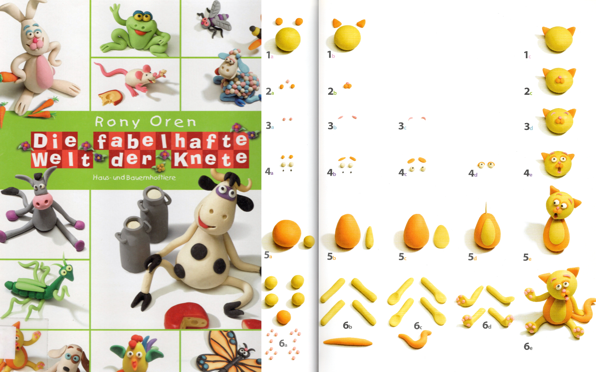
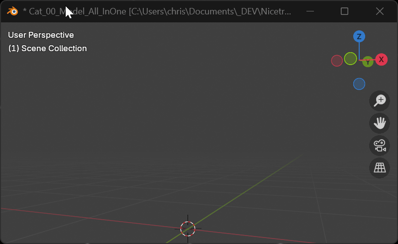
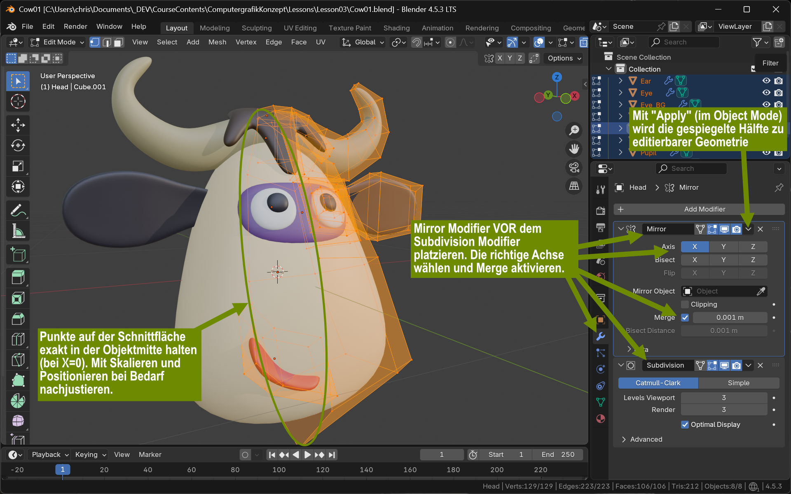
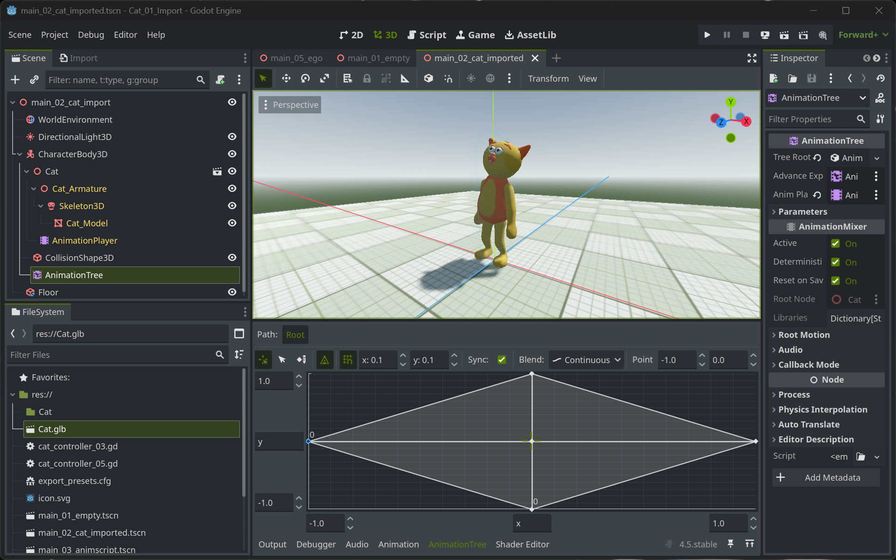
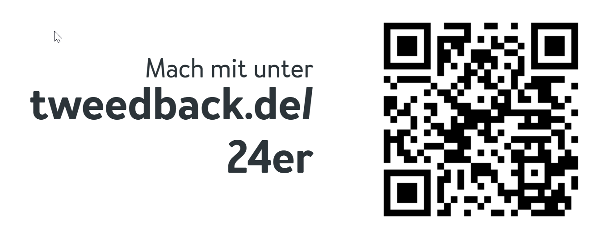

+++
title = 'Schnupperstudium - How to make a Game'
draft = false
weight = 40 
+++

## Guerilla Guide to 3D Char Creation

3D-Modelling ist komplex. Character in 3D zu modellieren ist komplexer. Char in 3D zu modellieren und zu animieren noch komplexer. Hier ist ein leicht zu erlerndender und nachzuvollziehender Ansatz.

### Modeling: Die Rony-Oren-Methode

Rony Oren ist ein Knet-Animateur und Prof. für Animation. In seinen Kinderbüchern lehrt er, wie man einfache Grundformen kombinieren kann, um daraus komplexe Figuren zu modellieren. 



Diese Methode lässt sich sehr gut auf das Modellieren in 3D mit einer passenden Software [wie z.B. Blender](https://blender.org) übertragen.



Um einzelne Knetklumpen zu formen sind nur wenige Grundkenntnisse erforderlich:

- **Punkte, Kanten & Flächen verschieben, rotieren und vergrößern/verkleinern:** Diese grundlegenden Transformationen ermöglichen es, die Geometrie eines 3D-Modells präzise zu bearbeiten, um die gewünschte Form und Proportionen zu erreichen.

- **Mirror-Modifier für Symmetrie:** Der Mirror-Modifier spiegelt das Modell entlang einer Achse, was besonders nützlich ist, um symmetrische Objekte effizient zu erstellen, ohne die Geometrie manuell duplizieren zu müssen.

- **Extrudieren, um neue "Äste" auszubilden:** Durch das Extrudieren von Flächen können neue Geometrien aus bestehenden Flächen herausgebildet werden, was ideal ist, um komplexe Strukturen wie Äste oder Gliedmaßen zu erzeugen.

- **Loop-Cut, um Formen ringförmig zu unterteilen:** Mit dem Loop-Cut-Werkzeug können zusätzliche Kanten in einem Modell hinzugefügt werden, um die Geometrie zu verfeinern und mehr Detail in bestimmten Bereichen zu schaffen.

- **Subdivision-Modifier, um aus eckigen Objekten runde zu machen:** Der Subdivision-Modifier glättet die Kanten eines Modells, indem er die Geometrie unterteilt, was zu weicheren und organischeren Formen führt, ideal für die Erstellung realistischer 3D-Objekte.

Wichtig ist es, die Modelle in der so genannten T-Pose zu modellieren (Arme seitlich gestreckt). Für die weitere Bearbeitung ist es von Vorteil, die Symmetrie entlang der X-Achse anzulegen und den Character in Richtung negative Y-Achse blicken zu lassen.




### Animationen: Mixamo

Um einen 3D-Character zu animieren, sind mehrere Schritte notwendig:

1. **Rigging:** Das 3D-Modell wird mit einem Skelett (Armature/Bones) versehen. Die Knochen werden so positioniert, dass sie die Anatomie des Characters nachbilden (z.B. Arme, Beine, Wirbelsäule).

2. **Skinning/Weight Painting:** Das Mesh wird an die Knochen gebunden. Dabei wird jedem Vertex des Modells zugewiesen, wie stark er von welchem Knochen beeinflusst wird. Dies geschieht durch das Setzen von Gewichten.

3. **Animation:** Die Knochen werden in verschiedenen Posen (Keyframes) positioniert. Die Software interpoliert zwischen diesen Keyframes, wodurch flüssige Bewegungen entstehen.

4. **Export:** Die Animation wird zusammen mit dem Modell exportiert (z.B. als FBX, glTF).

**Mixamo als Abkürzung:** [Mixamo](https://www.mixamo.com/) ist ein kostenloser Online-Service von Adobe, der diese Schritte stark vereinfacht. Man lädt ein 3D-Modell hoch, Mixamo riggt es automatisch und bietet Zugriff auf eine große Bibliothek vorgefertigter Animationen (Laufen, Springen, Kämpfen, etc.), die direkt auf den Character angewendet werden können. Das animierte Modell kann anschließend heruntergeladen und in Game Engines wie Godot verwendet werden.


Ein nach der Rony-Oren-Methode modellierter 3D-Character kann leicht in Blender als FBX-Datei exportiert werden, dann mittels Mixamo mit Animationen versehen werden. Ganz nebenbei fügt Mixamo dem Character gleich auch noch ein Skelett hinzu und wichtet die Geometrie, um so zu bestimmen, welcher Teil des Körpers welchen Skelett-Knochen folgt. 

Um einen Character in einem Game zu verwenden, muss er verschiedene Fortbewegungsarten beherrschen:

- Idle
- Vorwärts gehen
- Seitlich nach links und rechts gehen
- Rennen
- Springen...

Diese Animationen lassen sich einzeln in Mixamo exportieren und wieder in Blender zusammenfügen.


Schließlich kann das Modell mit allen Animationssequenzen als .glb-Datei als Asset für eine Game Engine exportiert werden.

## Animierte Character als Game Assets

In der kostenlosen Game-Engine [Godot](https://www.godotengine.org) lassen sich animierte 3D-Assets zu interaktiv steuerbaren Characteren weiterverarbeiten. 

### Import in Godot

Um ein GLB-Modell mit Animationen in Godot zu importieren:

1. **Datei ins Projekt kopieren:** Die .glb-Datei in den Projektordner (z.B. `res://assets/characters/`) verschieben. Godot erkennt die Datei automatisch.

2. **Import-Einstellungen anpassen:** Die .glb-Datei im FileSystem-Panel auswählen und im Import-Tab (oben) folgende Einstellungen vornehmen:
    - **Root Type:** Node3D oder CharacterBody3D (je nach Verwendungszweck)
    - **AnimationPlayer → Clips:**. Für jeden Animationsclip ***Loop Mode auf Linear stellen***
    - Nach Änderungen auf "Reimport" klicken.

3. **In Scene einfügen:** Die .glb-Datei in eine beliebige Szene einfügen. Rechtsklick auf das neu eingefügte Objekt in der Szene und "Editable Children" aktivieren.

4. **AnimationPlayer prüfen:** Der importierte Character enthält einen AnimationPlayer-Node mit allen Animationen. Im AnimationPlayer-Panel können diese abgespielt und getestet werden.

### Animationen vorbereiten

Ein einfacher Character-Controller sollte die Figur in alle vier Hauptrichtungen laufen lassen und dabei je nach Richtung die passende Animation abspielen. Für das Rückwärtsgehen kann die Animation zum Vorwärtsgehen rückwärts abgespielt werden. Bewegt sich der Character gar nicht, sollte eine **Idle**-Animation abgespielt werden, die den Character auf der Stelle bewegt.

Dazu eignet sich ein **AnimationTree**, der mit einem Blendspace 2D ausgestattet ist. Dieser sorgt für flüssige Übergänge zwischen Animationen (z.B. von Idle zu Walk). 



### Objekt mittels CharacterBody3D fortbewegen

Um einen Character in Godot steuerbar zu machen, wird er als **CharacterBody3D** eingerichtet. Godot bietet dafür ein vorgefertigtes Skript-Template, das grundlegende Bewegung bereits implementiert:

- **Eingabe-Handling:** Das Skript reagiert auf Tastenanschläge (WASD/Pfeiltasten) und übersetzt sie in Bewegungsrichtungen.
- **Velocity-basierte Bewegung:** Der Character bewegt sich mit einer definierten Geschwindigkeit (`speed`) und kann springen (`jump_velocity`).
- **Schwerkraft:** Physikalische Schwerkraft wird automatisch angewendet, sodass der Character nach dem Springen wieder auf den Boden fällt.
- **Kollisionserkennung:** Eingebaute Funktionen wie `move_and_slide()` sorgen dafür, dass der Character nicht durch Wände oder den Boden fällt.


Dieses Skript steuert zwar den Character durch die 3D-Welt, aber es löst noch nicht die Animationen aus, dazu muss es erweitert werden.

### Animationen passend zur Fortbewegung auslösen

Der Parameter "Blend Position" des AnimationTree besteht aus einem 2D-Vektor, der die im AnimationNodeBlendspace2D angeordneten Animations-Clips miteinander mischt. Dieser kann direkt per Skript übergeben werden:

```python
var input_dir := Input.get_vector("ui_right", "ui_left", "ui_down", "ui_up")
$AnimationTree.set("parameters/blend_position", input_dir)
```

### Weiche Animationsübergänge

Um nicht unmittelbar von einem Animationsclip zum nächsten umzuschalten, kann die vom Benutzer per Pfeiltasten vorgegebene Bewegungsrichtung verzögert aus dem aktuellen in den gewünschten Zusatand animiert werden. Dadurch fließen die Animationsclips (z. B. von Idle nach Walk) ineinander über. 

Eine derartige Verzögerung lässt sich implementieren, in dem der Abstands-Vektor berechnet wird, der auf den aktuellen Zustand aufaddiert werden müsste, um den gewünschten Zustand zu erreichen. `(input_dir - input_cur)`. Dazu muss der aktuelle Zustand in einer Variablen `input_cur` zwischengespeichert werden.

Statt diesen direkt aufzuaddieren, kann er in der Länge beschnitten werden (mit `clamp`). Dadurch wird das Umschalten von einem 

```python
var input_dir := Input.get_vector("ui_right", "ui_left", "ui_down", "ui_up")
input_cur += (input_dir - input_cur).clamp(
    Vector2(-input_acc, -input_acc), Vector2(input_acc, input_acc))
$AnimationTree.set("parameters/blend_position", input_cur)
```

## Fragen an Euch!



https://tweedback.de/24er


### Welche 3D Games spielst du (häufig)?

### Was hat dich daran technisch besonders fasziniert?

### Worüber würdest du im Informatik-Studium im Bereich 3D Games gerne mehr erfahren?


